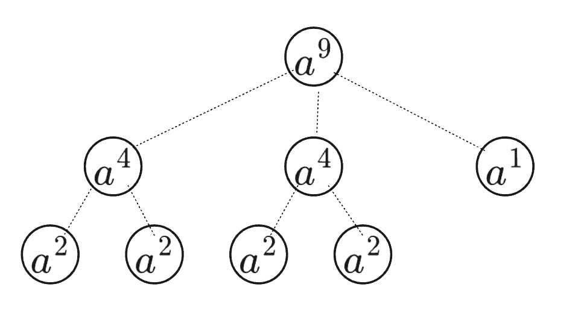

本页面将简要介绍倍增法。

## 定义

倍增法（英语：binary lifting）是由分治、递归算法延伸推广出的一种处理问题的极其常用的思想，可以解决如快速幂、[LCA（最近公共祖先）](../graph/lca.md)、求后缀数组等一系列问题。

这个方法在很多算法中均有应用，其中最常用的是求 [LCA（最近公共祖先）](../graph/lca.md)。


## 快速幂

幂运算$a^n$ 即 $n$ 个 $a$ 相乘， 正常情况下计算$a^n$ 的时间复杂度为$O(n)$，快速幂则是运用倍增的思想更快的计算出$a^n$。

### 做法一： 递归分治法

例如: 求  $a^{16}$ ,  **自底而上**模拟可以先算出 $a^2$ ，再计算出 $(a^2)^2$， 然后计算出 $((a^2)^2)^2$,  最后计算出$(((a^2)^2)^2)^2$ ； 即$a^{16} $的值就得出来了，这就是倍增思想。

通过模拟可以发现，迭代的规模每次是当前规模的一倍， 这个刚好可以使用递归分治拆解子问题，回溯计算。

需要注意的是：当拆解过程中，遇到奇数 $n$  和 偶数$n$ 的处理方式。

- $f(i) * f(i) * a$
- $f(i) * f(i)$



```cpp
int  _pow(int n, int k){
	if (k == 1) return n;   
	
	int tmp = _pow(n, k/2); 
	if (k % 2 == 1) return tmp * tmp * n;   // 判断奇数
	else return tmp * tmp;       // 判断偶数
}
```


### 做法二： 位运算做倍增

例如: 求  $a^{13}$ ,    将 $a^{13}$的13按照二进制位做拆分， 得到 $a^{13} = a^8 * a^4 * a^1$，我们会发现每个对应的都是$a$​ 的倍乘关系， 所以我们只需处理n就可以了。


| k       | tmp  (tmp *= tmp) 倍增 |    ans        |
| :------: | :--------------:|:-------------:|
| 1101 | $a^1$ | ans *= $a^1$ |
| 110 | $a^2$ |							|
| 11 | $a^3$ | ans *= $a^3$ |
| 1 | $a^4$ | ans *= $a^4$ |


```cpp
int  _pow(int n, int k){
	int ans=1;
	int tmp=n;
	while (k){ // 拆分k
		if (k  & 1) ans *= tmp;   // 代表二进制个位为1  需要把结果乘起来
		tmp *= tmp;  // 倍增放大 a^1 -> a^2 -> a^4    
 		k >>= 1; // 把处理过的末项去掉
	}
	return ans;
}
```


## 树上倍增求 LCA

参见：[最近公共祖先](../graph/lca.md)


## 例题

### 题 1

???+ note "例题"
    如何用尽可能少的砝码称量出 $[0,31]$ 之间的所有重量？（只能在天平的一端放砝码）

??? note "解题思路"
    答案是使用 1 2 4 8 16 这五个砝码，可以称量出 $[0,31]$ 之间的所有重量。同样，如果要称量 $[0,127]$ 之间的所有重量，可以使用 1 2 4 8 16 32 64 这七个砝码。每次我们都选择 2 的整次幂作砝码的重量，就可以使用极少的砝码个数量出任意我们所需要的重量。
    
    为什么说是极少呢？因为如果我们要量出 $[0,1023]$ 之间的所有重量，只需要 10 个砝码，需要量出 $[0,1048575]$ 之间的所有重量，只需要 20 个。如果我们的目标重量翻倍，砝码个数只需要增加 1。这叫「对数级」的增长速度，因为砝码的所需个数与目标重量的范围的对数成正比。


### 题2 [洛谷 P1226 快速幂](https://www.luogu.com.cn/problem/P1226) 
???+ note "快速幂"
    给你三个整数 $a,b,p$，求 $a^b \bmod p$。

??? note "解题思路"
    $(a  \%  p)^b == a^b \% p$

??? note "参考代码"
    ```cpp
    --8<-- "docs/basic/code/binary-lifting/P1226.cpp"
    ```
