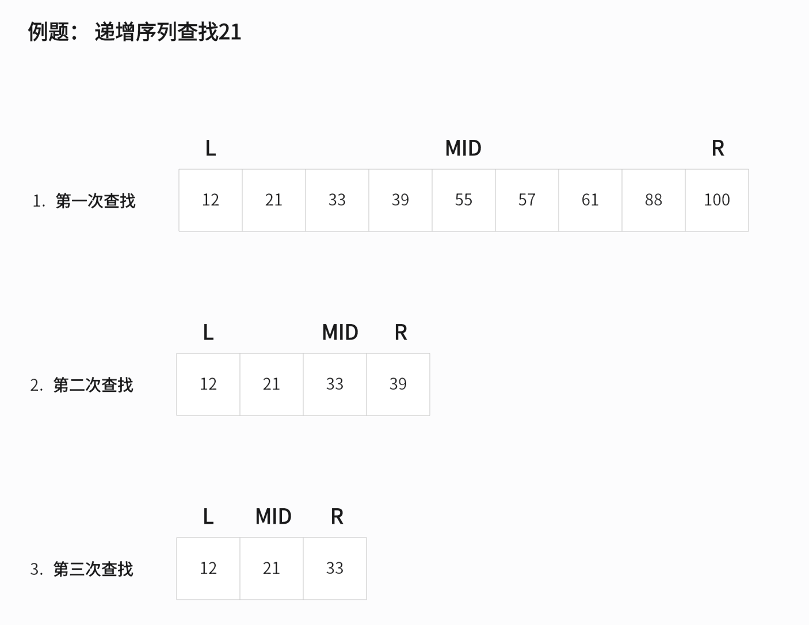
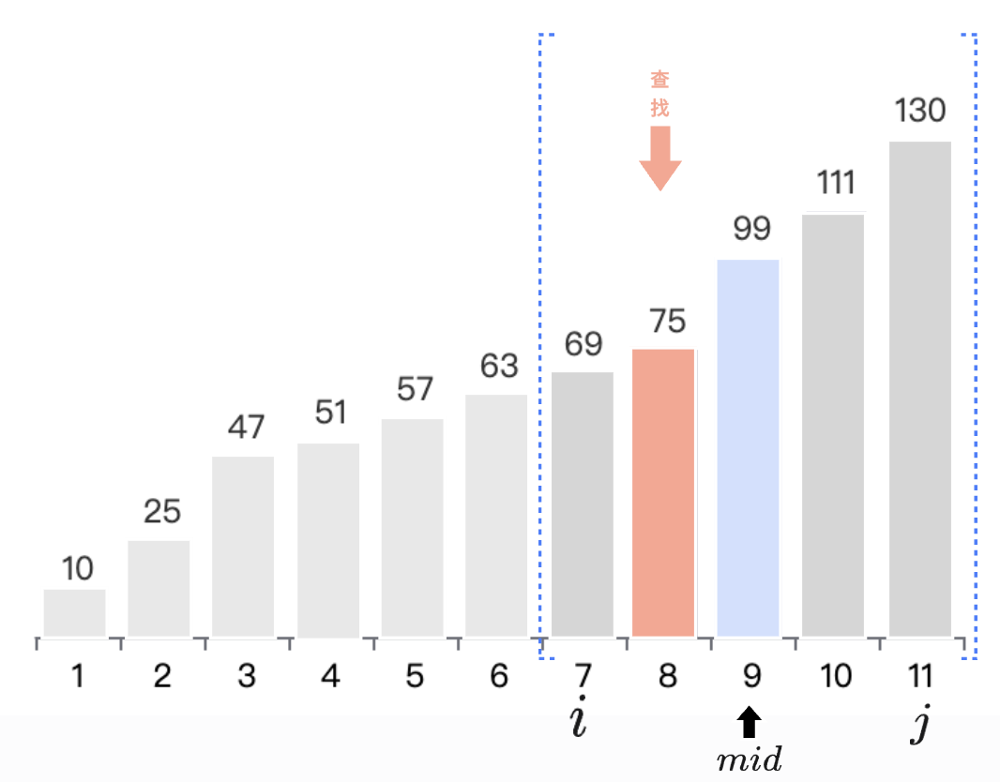
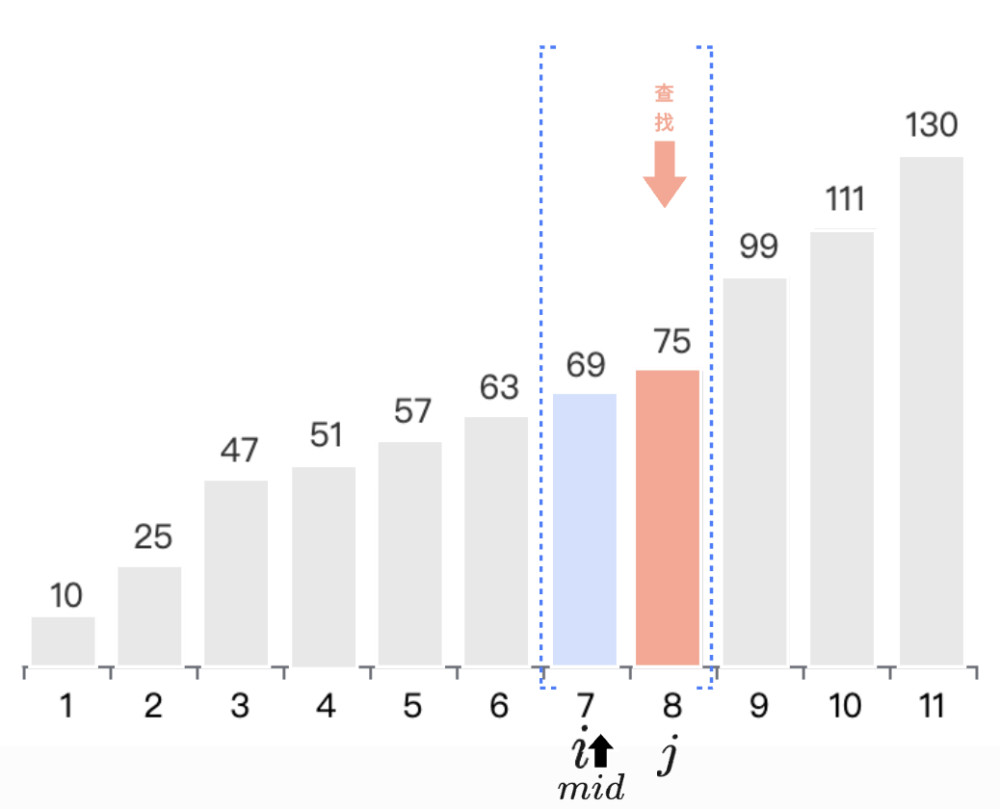
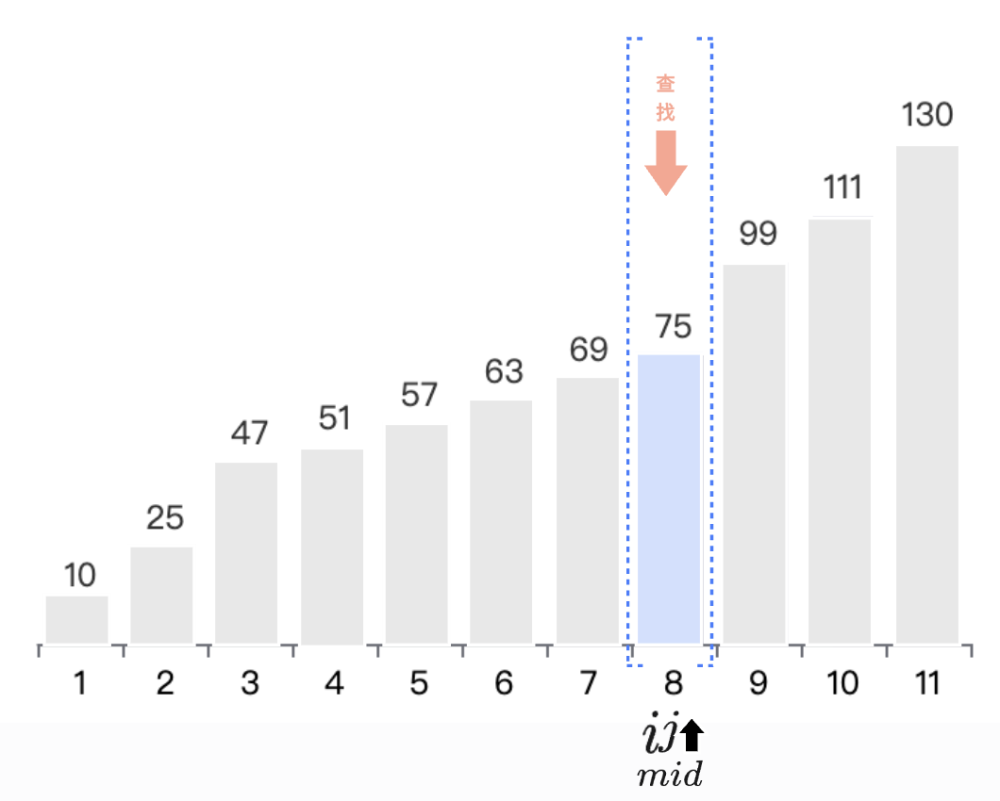

本页面将简要介绍二分查找、左值查找、右值查找

## 二分查找

### 定义

二分查找（英语：binary search），也称折半搜索（英语：half-interval search）、对数搜索（英语：logarithmic search），是用来在一个**有序**数组中查找某一元素的算法。

### 过程

以在一个升序数组中查找一个数为例。

它每次考察数组当前部分的中间元素，如果中间元素刚好是要找的，就结束搜索过程；如果中间元素小于所查找的值，那么左侧的只会更小，不会有所查找的元素，只需到右侧查找；如果中间元素大于所查找的值同理，只需到左侧查找。

### 性质

#### 时间复杂度

二分查找的最优时间复杂度为 $O(1)$。

二分查找的平均时间复杂度和最坏时间复杂度均为 $O(\log n)$。因为在二分搜索过程中，算法每次都把查询的区间减半，所以对于一个长度为 $n$ 的数组，至多会进行 $O(\log n)$ 次查找。

#### 空间复杂度

迭代版本的二分查找的空间复杂度为 $O(1)$。

递归（无尾调用消除）版本的二分查找的空间复杂度为 $O(\log n)$。

### 实现

=== "<1>"
    
=== "<2>"
    
=== "<3>"
    
=== "<4>"
    


```cpp
// 整数二分
int binary_search(int L, int R, int key) {
  int ret = -1;  // 未搜索到数据返回-1下标
  int mid;
  while (L <= R) {
    mid = L + ((R - L) >> 1);  // 会存在 L + R > int 的可能性 ，所以使用这种方式
    if (arr[mid] < key)
      L = mid + 1;
    else if (arr[mid] > key)
      R = mid - 1;
    else {  // 最后检测相等是因为多数搜索情况不是大于就是小于
      ret = mid;
      break;
    }
  }
  return ret;  // 单一出口
}
```


???+ note "说明"
    参考 [编译优化 #位运算代替乘法](/lang/optimizations/#%E4%BD%8D%E8%BF%90%E7%AE%97%E4%BB%A3%E6%9B%BF%E4%B9%98%E6%B3%95)，对于 $n$ 是有符号数的情况，当你可以保证 $n\ge 0$​ 时，`n >> 1` 比 `n / 2` 指令数更少。

### 终止条件

网上有很多写法`L <= R`、`L < R`、`L + 1 < R` ， 要了解这些写法的不同，首先我们要了解三个概念

- 全闭区间 $[L, R]$：区间范围从 $L$ 开始 到 $R$ 终止 (包含 $L$ 和 $R$);
- 左闭右开 $[L, R)$：区间范围从 $L$ 开始 到 $R-1$ 结束 (不包含 $R$);
- 全开区间 $(L, R)$：区间范围从 $L+1$ 开始 到 $R-1$ 结束(不包含 $L$、$R$)。

当了解以上概念后，就比较好理解了

- 当全闭区间时， `L < R`、`L == R` 是在区间范围内的数据， `L > R` 则不在区间范围内，故选择 `L <= R`;
- 当左闭右开区间时，`L < R` 是区间范围内的数据， 但是 `L == R` 却分两种情况， 一种是向左查找，`L == R` 允许； 一种是向右查找， `L == R`超出查找范围，不允许，  `L > R` 同样也不在区间范围内， 故选择 `L < R`；
- 当全开区间时同上，把左侧的判断加上即可，  故选择 `L + 1 < R`

???+ note "提示"
    终止条件最好统一， 当使用某种终止条件写法的时候，写其他变种的二分时也要使用同种终止条件，避免搞混。


## 左值查找

当有序序列里有重复的元素，我们想要查找该元素第一次出现的位置的时候，就需要用到左值查找。

### 区别

运用贪心的性质，当碰到 `arr[mid] == key` 的时候不能退出，接着向左探测，判断更左侧的可能性，直到`L > R` 的时候停止。

### 实现

```cpp
int binary_search(int L, int R, int key) {
  int ret = -1;  // 未搜索到数据返回-1下标
  int mid;
  while (L <= R) {
    mid = L + ((R - L) >> 1);  // 会存在 L + R > int 的可能性 ，所以使用这种方式
    if (arr[mid] < key)
      L = mid + 1;
    else if (arr[mid] > key)
      R = mid - 1;
    else {  
      R = mid - 1;
      ret = mid;   // 每查找到一次，就更新为最新位置
    }
  }
  return ret;  // 单一出口
}
```


## 右值查找

与左值查找相反，当有序序列里有重复的元素，我们想要查找该元素第一次出现的位置的时候，就需要用到右值查找。

### 区别

运用贪心的性质，当碰到 `arr[mid] == key` 的时候不能退出，接着向右探测，判断更右侧的可能性，直到`L > R` 的时候停止。

### 实现

```cpp
int binary_search(int L, int R, int key) {
  int ret = -1;  // 未搜索到数据返回-1下标
  int mid;
  while (L <= R) {
    mid = L + ((R - L) >> 1);  // 会存在 L + R > int 的可能性 ，所以使用这种方式
    if (arr[mid] < key)
      L = mid + 1;
    else if (arr[mid] > key)
      R = mid - 1;
    else {  
      L = mid + 1;
      ret = mid;
    }
  }
  return ret;  // 单一出口
}
```


## 题单

- [洛谷 P2249](https://www.luogu.com.cn/problem/P2249)
- [洛谷 P1102](https://www.luogu.com.cn/problem/P1102)

