## 前缀和

### 一维前缀和

前缀和可以简单理解为「数列的前 $n$ 项的和」，是一种重要的预处理方式，能大大降低查询的时间复杂度，常用来快速求解一段区间内的和。

C++ 标准库中实现了前缀和函数 [`std::partial_sum`](https://zh.cppreference.com/w/cpp/algorithm/partial_sum)，定义于头文件 `<numeric>` 中。

=== "<1>"
    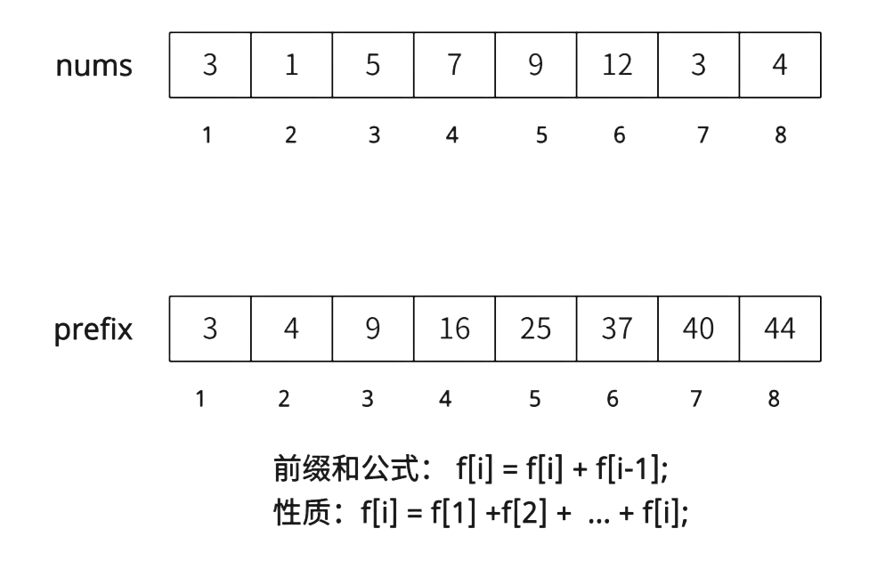     
=== "<2>"
    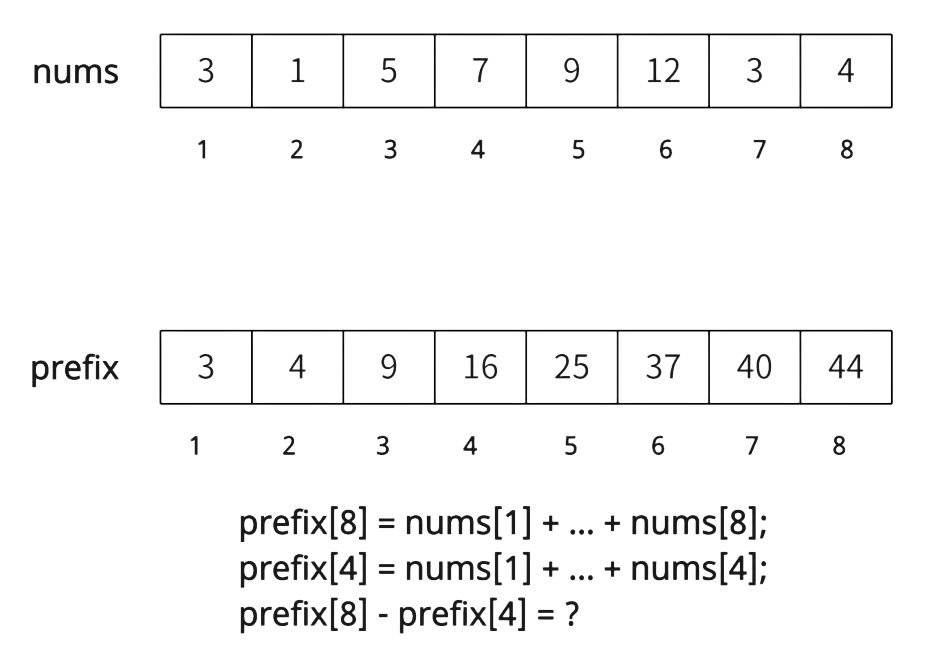        
=== "<3>"
    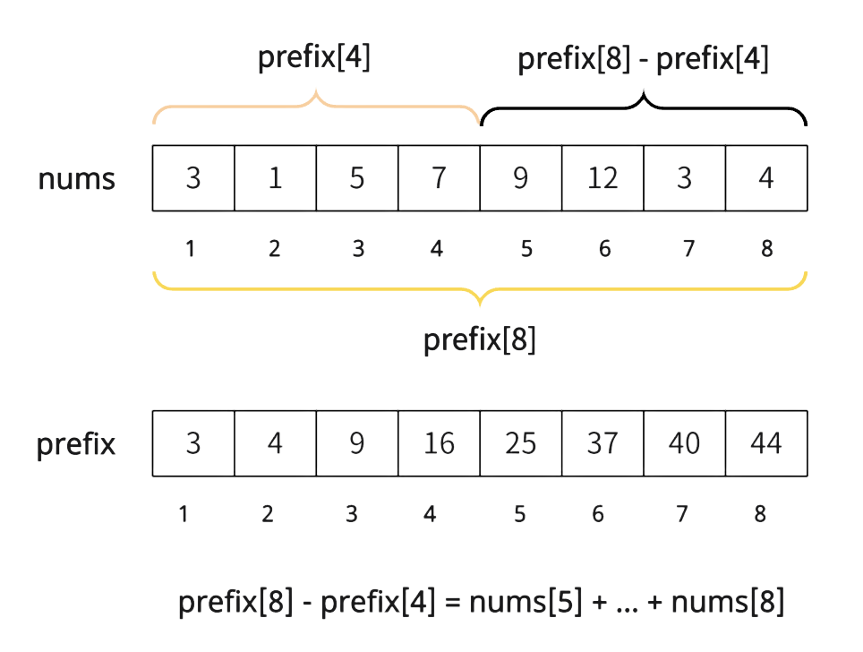

???+ note "代码模版"
    ```cpp
    for (int i=1; i<=n; i++){
        f[i] = f[i] + f[i-1];
    }
    ```


#### 例题 [洛谷 P8218 求区间和](https://www.luogu.com.cn/problem/P8218)

??? 例题
    给定 $n$个正整数组成的数列 $a_1, a_2, \cdots, a_n$ 和 $m$ 个区间 $[l_i,r_i]$，分别求这 $m$ 个区间的区间和。
    对于所有测试数据，$n,m\le10^5,a_i\le 10^4$
    

    输入第一行，为一个正整数 $n$；第二行，为 $n$ 个正整数 $a_1,a_2, \cdots ,a_n$；第三行，为一个正整数 $m$ ；接下来 $m$ 行，每行为两个正整数 $l_i,r_i$ ，满足$1\le l_i\le r_i\le n$。
    
    输入
    ```
    4
    4 3 2 1
    2
    1 4
    2 3
    ```
    输出
    ```
    10
    5
    ```

??? note "解题思路"
    这道题如果使用暴力的方式来写的话，时间复杂度最坏为$O(n*m)$，很明显会超时； 所以要采用前缀和的方式求解。 首先对 $a$ 数组做前缀和预处理， 然后对区间求解 $a[r] - a[l-1]$，时间复杂度为$O(n+m)$​。

    注意，一定是减去$a[l-1]$ 而不是 $a[l]$；因为减去 $a[l]$ 则会把$l$的值减掉。

??? note "参考代码"
    ```cpp
    --8<-- "docs/basic/code/prefix-sum/prefix-sum_1.cpp"
    ```


### 二维/多维前缀和

多维前缀和的普通求解方法几乎都是基于容斥原理， 可以用来快速求子矩阵和。
=== "<1>"
    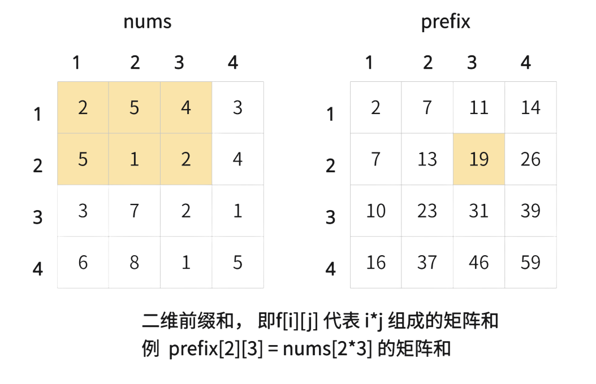     
=== "<2>"
    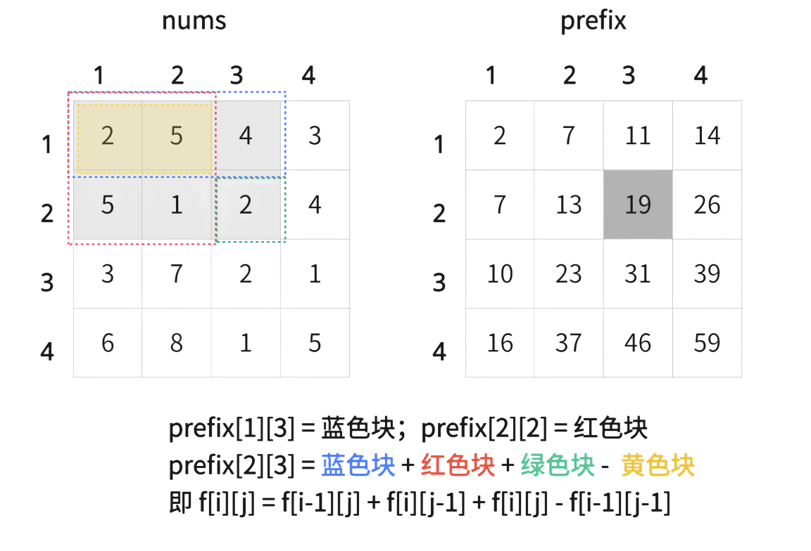        
=== "<3>"
    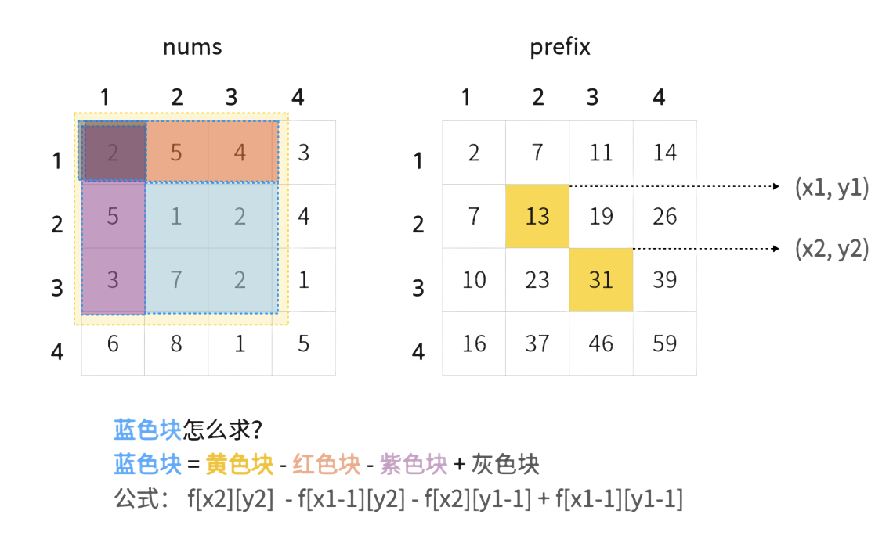

#### 例题 [洛谷 P1719 最大加权矩形](https://www.luogu.com.cn/problem/P1719)

???+ note "洛谷 P1719 最大加权矩形"
    在一个 $n\times n$ 的矩阵中，求最大子矩阵和(矩阵位置可以为负数)  $n \le 120$。

???note "解题思路"
    通过题意可知，就是求最大的子矩阵之和，并且$N \le 120$, 我们可以做完二维前缀和后，枚举每个子矩阵的位置，进行暴力判断即可。(当然也有DP的方式求解，这个留待以后)


??? note "参考代码"
    ```cpp
    --8<-- "docs/basic/code/prefix-sum/prefix-sum_2.cpp"
    ```


## 差分

### 一维差分
差分是前缀和的逆运算。差分数组做完前缀和之后 会得到原数组，功能是快速的让一段区间加上一个数字。 C++ 标准库中实现了差分函数 [`std::adjacent_difference`](https://zh.cppreference.com/w/cpp/algorithm/adjacent_difference)，定义于头文件 `<numeric>` 中。

=== "<1>"
    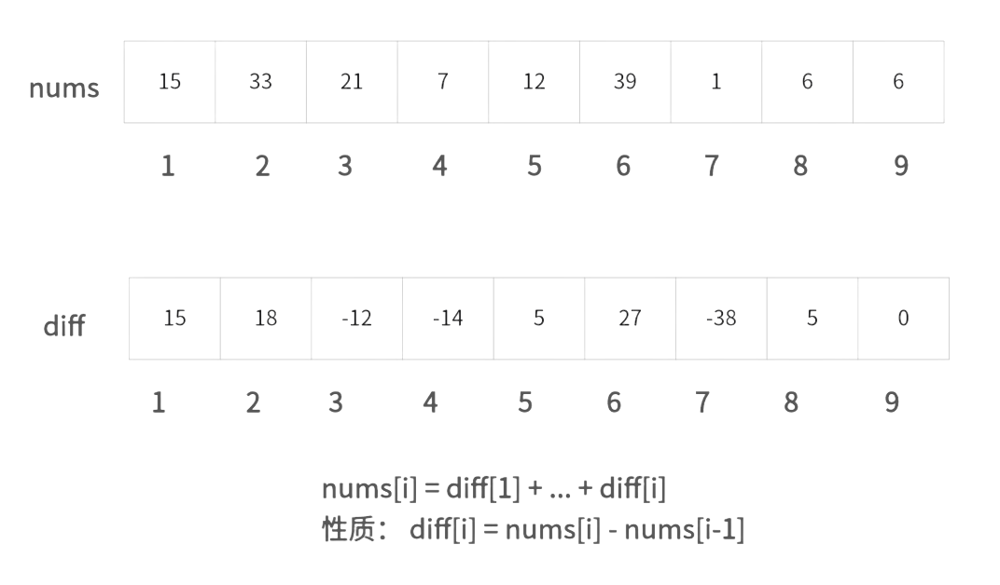     
=== "<2>"
    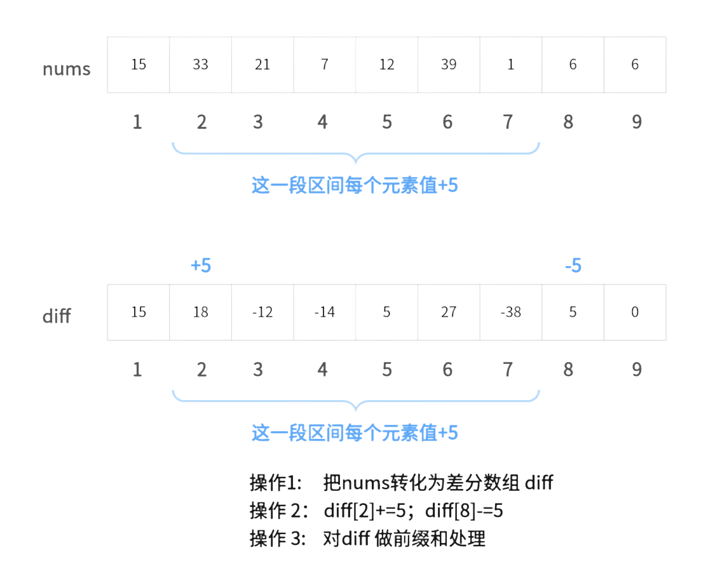        
=== "<3>"
    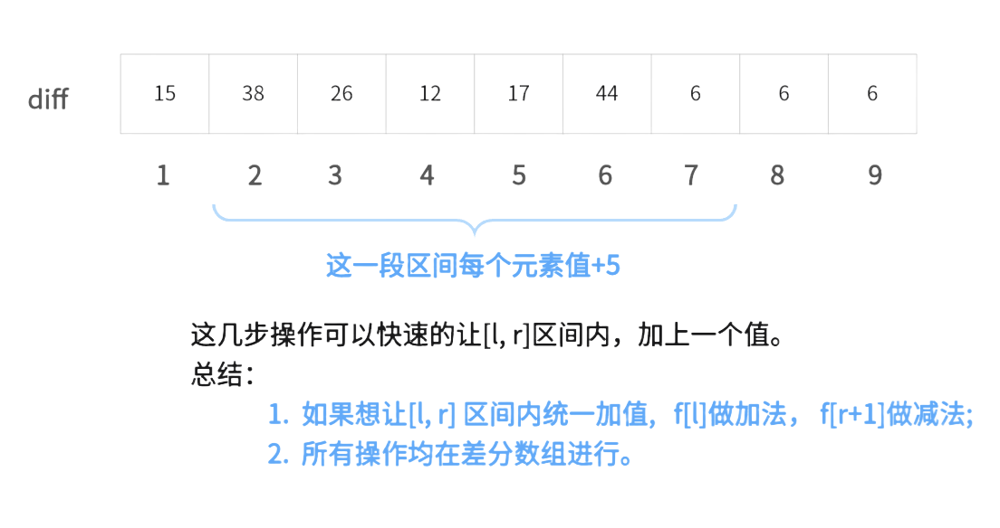


#### 例题 [洛谷 P2367 语文成绩](https://www.luogu.com.cn/problem/P2367)
???+ note "语文成绩"
    语文老师总是写错成绩，所以当她修改成绩的时候，总是累得不行。她总是要一遍遍地给某些同学增加分数，又要注意最低分是多少。你能帮帮她吗？
   	
??? note "解题思路"
    通过题意可知， 语文老师需要批量的修改某些学生的成绩， 并且每次修改的成绩是一样的，那么就可以使用差分来做了。 首先需要对初始成绩数组进行差分，把数组转化为差分数组，然后进行加减法操作， 最后做前缀和找到最小值即可。

??? note "参考代码"
    ```cpp
    --8<-- "docs/basic/code/prefix-sum/prefix-sum_3.cpp"
    ```

### 二维差分
二维差分和一维差分一样， 不同的是，二维差分是让子矩阵的每个元素加一个值。

=== "<1>"
    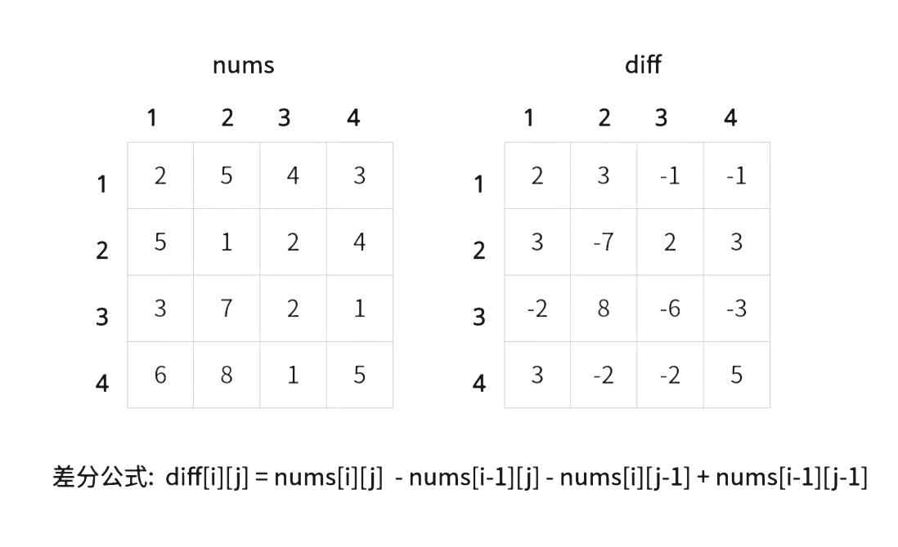     
=== "<2>"
    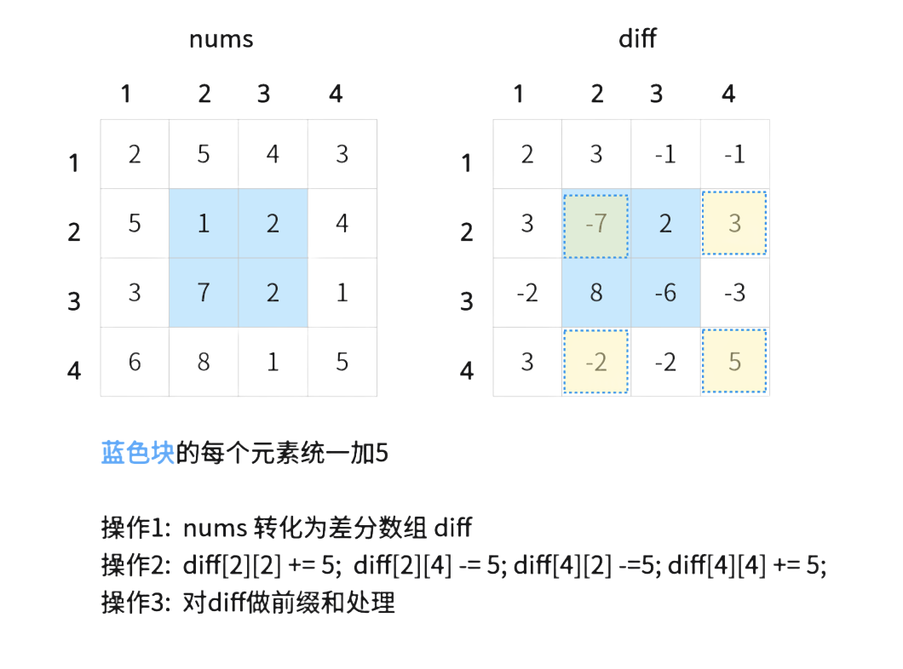        
=== "<3>"
    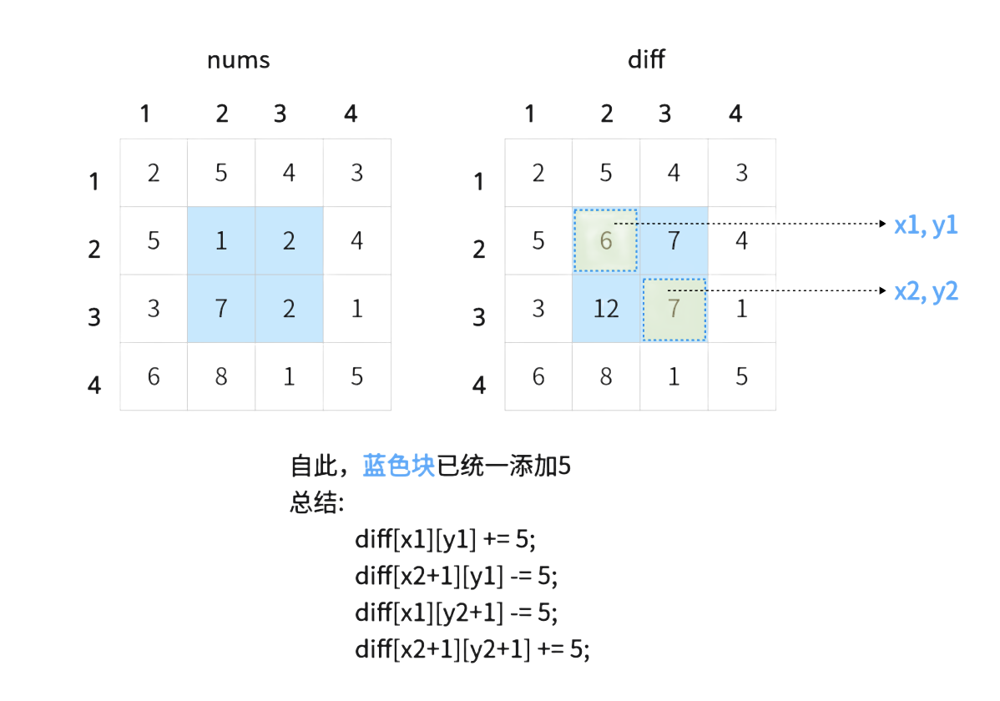


#### 例题 [洛谷 P3397 地毯](https://www.luogu.com.cn/problem/P3397)
???+ note "地毯"
    在 $n\times n$ 的格子上有 $m$ 个地毯。给出这些地毯的信息，问每个点被多少个地毯覆盖。
   	
??? note "解题思路"
    运用二维差分记录每个地毯， 最后做二维前缀和， 并把数组打印出来即可。

??? note "参考代码"
    ```cpp
    --8<-- "docs/basic/code/prefix-sum/prefix-sum_4.cpp"
    ```


## 习题

一维前缀和：

-   [洛谷 B3612【深进 1. 例 1】求区间和](https://www.luogu.com.cn/problem/B3612)
-   [洛谷 U69096 前缀和的逆](https://www.luogu.com.cn/problem/U69096)
-   [「USACO16JAN」子共七 Subsequences Summing to Sevens](https://www.luogu.com.cn/problem/P3131)
-   [「USACO05JAN」Moo Volume S](https://www.luogu.com.cn/problem/P6067)

***

二维前缀和：

- [洛谷 P1387 最大正方形](https://www.luogu.com.cn/problem/P1387)

- [洛谷 P2004 领地选择](https://www.luogu.com.cn/problem/P2004)

  

***

一维差分：

-   [洛谷 P2367 语文成绩](https://www.luogu.com.cn/problem/P2367)
-   [洛谷 P1873 砍树](https://www.luogu.com.cn/problem/P1873?contestId=165897)


二维差分:

- [P3397 地毯](https://www.luogu.com.cn/problem/P3397)


