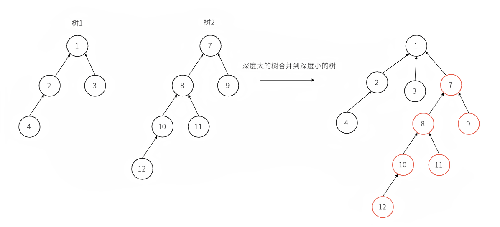
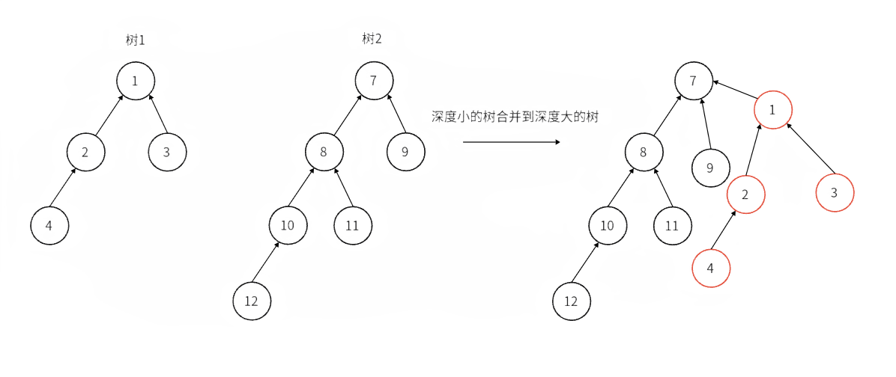

## 概念

并查集是一种用于管理元素所属集合的数据结构，实现为一个森林，其中每棵树表示一个集合，树中的节点表示对应集合中的元素。

顾名思义，并查集支持两种操作：

-   合并（Union）：合并两个元素所属集合（合并对应的树）
-   查询（Find）：查询某个元素所属集合（查询对应的树的根节点），这可以用于判断两个元素是否属于同一集合

并查集在经过修改后可以支持单个元素的删除、移动；使用动态开点线段树还可以实现可持久化并查集。


### 初始化

初始化时，每个元素都位于一个单独的集合，表示为一棵只有根节点的树。方便起见，我们将根节点的父亲设为自己。

???+ note "实现"
    ```cpp
    int dsu[20];
    
    int main() {
        for (int i=1; i<20; i++) dsu[i] = i;    // 设置自己的父节点为自己
    }
    ```


### 查询

我们需要沿着树向上移动，直至找到根节点。


???+ note "实现"
    因为初始化时，每个节点的根节点都是自己，所以在查找过程中，如果发现`dsu[x] == x` 代表`x` 是根节点。
    ```cpp
    int find(int x){
        return dsu[x] == x ? x: find(dsu[x]); 
    }
    ```

### 合并

要合并两棵树，我们只需要将一棵树的根节点连到另一棵树的根节点。


???+ note "实现"
    ```cpp
    int find(int x){
        return dsu[x] == x ? x: find(dsu[x]); 
    }
    
    int pa = find(x), pb = find(y);
    if (pa != pb) dsu[pa] = pb;    // pa == pb 代表两个点在一个集合树里了
    ```

## 优化方案

### 路径压缩合并

将该节点到根节点路径上的所有节点直接连接到根节点上，从而降低了后续查找操作的复杂度。


???+ note "实现"
    ```cpp
    int dsu[20];
    
    int find(int x){
        return dsu[x] == x ? x: dsu[x] = find(dsu[x]);
    }
    ```

### 按秩合并

将较小的树合并到较大的树上，这样可以减少树的高度增加的可能性。每个节点都会记录其所在树的秩（即树的高度或者近似的高度），在合并时比较两个树的秩，将较小秩的树连接到较大秩的树上。
=== "<1>"
    
=== "<2>"
    

???+ note "实现"
    ```cpp
    int pa = find(x), pb = find(y)
    if (pa != pb){
        // 按秩合并
        if (rank[pa] > rank[pb]) dsu[pb] = pa; 
        else if (rank[pa] < rank[pb]) dsu[pa] = pb;
        else {
            dsu[pa] = pb; //树高度相等时，则都可以
            rank[pb]++;  // 树高度增加
        }
    }
    ```
    

## 删除

要删除一个叶子节点，我们可以将其父亲设为自己。为了保证要删除的元素都是叶子，我们可以预先为每个节点制作副本，并将其副本作为父亲。

???+ note "实现"
    === "C++"
        ```cpp
        struct dsu {
          vector<size_t> pa, size;
        
          explicit dsu(size_t size_) : pa(size_ * 2), size(size_ * 2, 1) {
            iota(pa.begin(), pa.begin() + size_, size_);
            iota(pa.begin() + size_, pa.end(), size_);
          }
        
          void erase(size_t x) {
            --size[find(x)];
            pa[x] = x;
          }
        };
        ```
    
    === "Python"
        ```python
        class Dsu:
            def __init__(self, size):
                self.pa = list(range(size, size * 2)) * 2
                self.size = [1] * size * 2
        
            def erase(self, x):
                self.size[self.find(x)] -= 1
                self.pa[x] = x
        ```

## 移动

与删除类似，通过以副本作为父亲，保证要移动的元素都是叶子。

???+ note "实现"
    === "C++"
        ```cpp
        void dsu::move(size_t x, size_t y) {
          auto fx = find(x), fy = find(y);
          if (fx == fy) return;
          pa[x] = fy;
          --size[fx], ++size[fy];
        }
        ```
    
    === "Python"
        ```python
        def move(self, x, y):
            fx, fy = self.find(x), self.find(y)
            if fx == fy:
                return
            self.pa[x] = fy
            self.size[fx] -= 1
            self.size[fy] += 1
        ```

## 复杂度

### 时间复杂度

同时使用路径压缩和启发式合并之后，并查集的每个操作平均时间仅为 $O(\alpha(n))$，其中 $\alpha$ 为阿克曼函数的反函数，其增长极其缓慢，也就是说其单次操作的平均运行时间可以认为是一个很小的常数。

[Ackermann 函数](https://en.wikipedia.org/wiki/Ackermann_function)  $A(m, n)$ 的定义是这样的：

$A(m, n) = \begin{cases}n+1&\text{if }m=0\\A(m-1,1)&\text{if }m>0\text{ and }n=0\\A(m-1,A(m,n-1))&\text{otherwise}\end{cases}$

而反 Ackermann 函数 $\alpha(n)$ 的定义是阿克曼函数的反函数，即为最大的整数 $m$ 使得 $A(m, m) \leqslant n$。

时间复杂度的证明 [在这个页面中](./dsu-complexity.md)。

### 空间复杂度

显然为 $O(n)$。

## 带权并查集

我们还可以在并查集的边上定义某种权值、以及这种权值在路径压缩时产生的运算，从而解决更多的问题。比如对于经典的「NOI2001」食物链，我们可以在边权上维护模 3 意义下的加法群。

## 例题

???+ note "[UVa11987 Almost Union-Find](https://onlinejudge.org/index.php?option=com_onlinejudge&Itemid=8&category=229&page=show_problem&problem=3138)"
    实现类似并查集的数据结构，支持以下操作：
    
    1.  合并两个元素所属集合
    2.  移动单个元素
    3.  查询某个元素所属集合的大小及元素和
    
    ??? note "参考代码"
        === "C++"
            ```cpp
            --8<-- "docs/ds/code/dsu/dsu_1.cpp"
            ```
        
        === "Python"
            ```python
            --8<-- "docs/ds/code/dsu/dsu_1.py"
            ```

## 习题

[「洛谷」P3367 并查集](https://www.luogu.com.cn/problem/P3367?contestId=171518)

[洛谷 P2256 一中校运会之百米跑](https://www.luogu.com.cn/problem/P2256?contestId=171518)

[P8654 [蓝桥杯 2017 国 C] 合根植物](https://www.luogu.com.cn/problem/P8654?contestId=171518)

[P8403 [CCC2022 J4] Good Groups](https://www.luogu.com.cn/problem/P8403?contestId=171518)

[P1536 村村通](https://www.luogu.com.cn/problem/P1536?contestId=171518)

[P2024 [NOI2001] 食物链](https://www.luogu.com.cn/problem/P2024?contestId=171518)

[P3144 [USACO16OPEN] Closing the Farm S](https://www.luogu.com.cn/problem/P3144?contestId=171518)

[P3958 [NOIP2017 提高组] 奶酪](https://www.luogu.com.cn/problem/P3958?contestId=171518)

[P8686 [蓝桥杯 2019 省 A] 修改数组](https://www.luogu.com.cn/problem/P8686?contestId=171518)

[P2658 汽车拉力比赛](https://www.luogu.com.cn/problem/P2658?contestId=171518)
